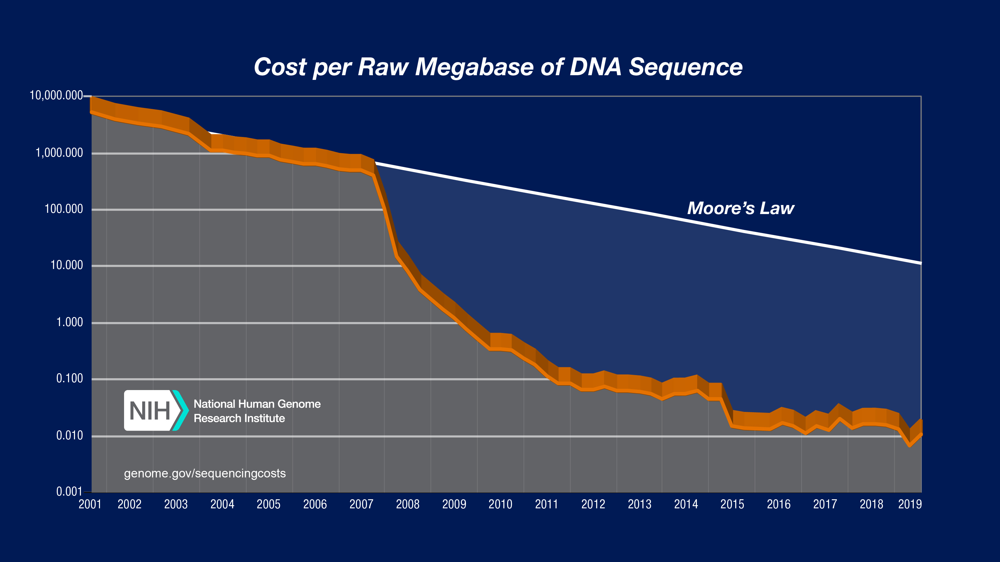
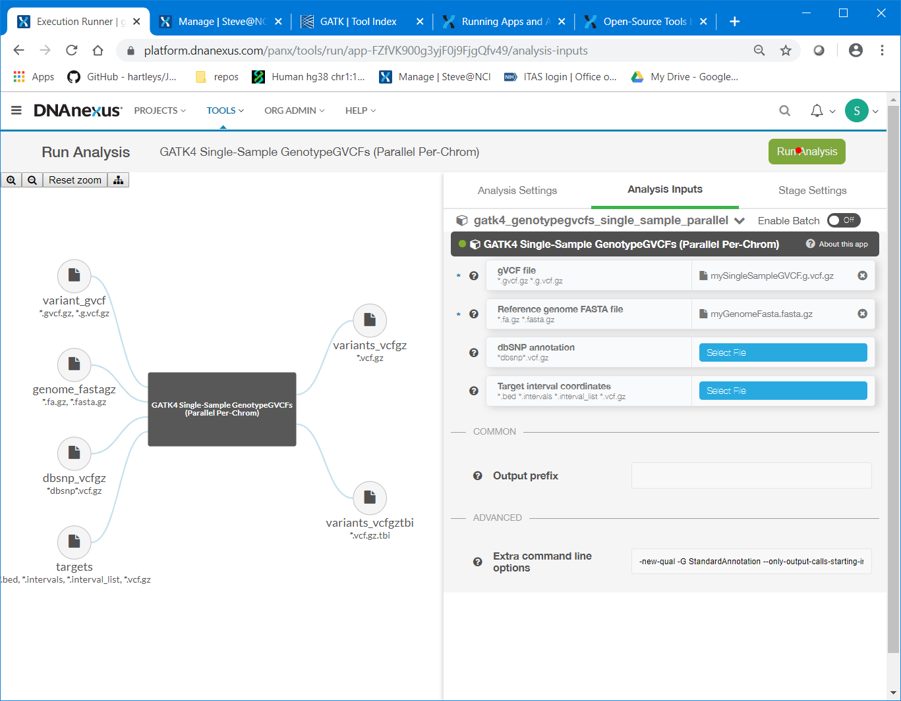

--- 
title: "Introduction to DNA Nexus and Cloud Computing for Bioinformatics"
author: "Stephen Hartley, PhD"
date: "`r Sys.Date()`"
site: bookdown::bookdown_site
output: bookdown::gitbook
documentclass: report
geometry: margin=0.75in
bibliography: [book.bib, packages.bib]
biblio-style: apalike
link-citations: yes
github-repo: hartleys/vArmyKnife
description: "A tutorial in the use of the DNA nexus command line interface (CLI)."
---
# Introduction to DNA Nexus and Cloud Computing for Bioinformatics {#MAINTITLE}

This document is intended to provide a basic introduction to the use of the DNA Nexus cloud computing platform
for biostats and bioinformatics.

This document can be accessed online at:

<font size="5"> [https://hartleys.github.io/DnaNexusTutorial/](https://hartleys.github.io/DnaNexusTutorial/) </font>

<!-- ################################################################################################################ --> 
<!-- ################################################################################################################ --> 
<!-- ################################################################################################################ --> 

## Hi! {#hi}

I'm Steve Hartley, Staff Scientist to Stephen Chanock.
I'm a bioinformaticist with a software engineering background. 

Feel free to come to me with questions or problems about:

* DNA Nexus
* Other cloud platforms
* Sequencing
* Bioinformatics
* Programming
* Computer program won't compile / won't run / throws bizarre errors

email me at:

<font size="5"> stephen.hartley@nih.mail.gov</font>

OR, drop by at:

<font size="5"> Room 7E582 </font>

## Target Audience: {#prepreintro2}

This document/presentation is intended for people of practically any experience level, 
but it will probably be most helpful for those who:

 * Have basic familiarity with linux/bash/command-line.
 * Hopefully know at least some python or R
 * Have basically zero familiarity with anything cloud-related
 * Want to run things on the cloud

## Audience Experience Level: {#targetAudience}

Which of you have:

* Used a linux command line
* Run jobs on Biowulf
* Run an R or python script
* Written an R or python script
* Developed novel software that other people use
* Run jobs on the DNA Nexus cloud
* Run jobs on any cloud

## Audience Needs: {#targetAudienceNeeds}

(To get an idea of what the usage level is going to be for this platform) 
Which of you feel you are currently:

* Being slowed down by biowulf's limited compute availability (jobs take too long to start or to run)
* Being slowed or limited by biowulf's storage availability (need more terabytes!)
* Expect one or both of the above to be true at some point in the near future

<!-- ################################################################################################################ --> 
<!-- ################################################################################################################ --> 
<!-- ################################################################################################################ --> 

# Why use the cloud? {#whycloud}

We're generating a lot of data now.

```{r, echo = FALSE, fig.cap = '', out.height="500pt"}

```

It's only going to get worse.

## Why use the cloud? {#whycloud2}

Biowulf is getting kinda crowded.

```{r, echo = FALSE, fig.cap = '', out.height="500pt"}

```

## Why use the cloud? {#whycloud3}

The Cloud offers advantages:

* Less waiting: jobs start faster, and don't get clogged up during busy hours
* Massive scalability: Submit thousands of jobs at once.
* Massive Storage: Store huge amounts of data for (relatively) cheap.
* Repeatability: You can share your exact code, environment, software versioning, etc, 
and others can repeat your analysis and get the exact same result 

<!-- ################################################################################################################ --> 
<!-- ################################################################################################################ --> 
<!-- ################################################################################################################ --> 

# Which Cloud to Use? {#whichCloud}

There are several different cloud platforms: 

* Microsoft Azure
* Amazon Web Services (AWS)
* Google Cloud Platform (GCP)

And a few platforms that are build on top of other platforms:
* Fire Cloud (based on GCP)
* DNA Nexus (mix of AWS/Azure)

## Which Cloud to Use? {#whichCloud1}

We're mainly exploring GCP and DnaNexus.

Google Cloud Platform (GCP)
* Cheaper
* More Flexible
* More complicated to use
* We are having technical difficulties with account creation/admin

DNA Nexus:
* More Expensive
* User-Friendly
* Easy app/workflow sharing
* We can create an account and have you running pipelines **today**

## Which Cloud to Use? {#whichCloud2}

Eventually, we're going to want to migrate most of our work to GCP (if possible).

But if you want to try working in the cloud, DnaNexus is available now.

<!-- ################################################################################################################ --> 
<!-- ################################################################################################################ --> 
<!-- ################################################################################################################ --> 

# DNA Nexus {#dnanexusIntro}

DNA Nexus is a cloud based system designed to make cloud computing more accessable to bioinformaticians, biostatisticians, 
and computational biologists.

```{r, echo = FALSE, fig.cap = '', out.height="300pt"}
knitr::include_graphics("img/dnaNexus.frontpage.PNG")
```

We are using DNA nexus as to gauge interest in cloud computing and cloud storage. 

Eventually (hopefully) many of us will move over to the google cloud platform (GCP) or azure (which are substantially cheaper). 

But we don't currently have the ability to create accounts on GCP/azure and hook them up to payment.

<!-- ################################################################################################################ --> 
<!-- ################################################################################################################ --> 
<!-- ################################################################################################################ --> 

# Getting Started {#getStarted}

Go to dnanexus.com, create an account and create a new project.

To get preliminary access to funds, add me to your project as an admin and send me an email at: stephen.hartley@nih.mail.gov

We have a small shared org account with a few hundred dollars in it. 

We won't get more until we start seeing it get used up.

## Getting Started {#getStarted1}

Create a new account:

```{r, echo = FALSE, fig.cap = '', out.height="600pt"}

```

## Getting Started {#getStarted2}

Create a new project:

```{r, echo = FALSE, fig.cap = '', out.height="600pt"}

```

## Getting Started {#getStarted3}

Create a new project:

```{r, echo = FALSE, fig.cap = '', out.height="600pt"}

```

## Getting Started {#getStarted4}

Add me to the project:

```{r, echo = FALSE, fig.cap = '', out.height="600pt"}

```

## Getting Started {#getStarted5}

Add me to the project (username hartleys):

```{r, echo = FALSE, fig.cap = '', out.height="600pt"}

```

## Getting Started {#getStarted6}

And then just send me an email (again: stephen.hartley@nih.mail.gov)! 

I'll hook it up to the shared org account so you can start running stuff.

<!-- ################################################################################################################ --> 
<!-- ################################################################################################################ --> 
<!-- ################################################################################################################ --> 

# Command Line vs GUI {#CMDvsGUI}

There are two ways to interact with DnaNexus: through the command line tool (dx), and through the webpage.

The command line tool is more flexible and can do some things that the 
web interface cannot, but the vast majority of tasks that users will likely encounter can be carried out using 
either interface.

## The Web Interface {#dxweb0}

The main project page will show you the file directory tree for your project.

```{r, echo = FALSE, fig.cap = '', out.height="600pt"}

```

## The Web Interface {#dxweb1}

You can upload data to the cloud for free.

But of course once your data is uploaded, you WILL start paying for storage.

```{r, echo = FALSE, fig.cap = '', out.height="600pt"}

```

## The Web Interface {#dxweb2}

Similarly, files can be downloaded from DNA Nexus, although for large files you will incur fees.

```{r, echo = FALSE, fig.cap = '', out.height="600pt"}

```

## The Web Interface {#dxweb4}

Files can be uploaded using simple drag and drop. 

```{r, echo = FALSE, fig.cap = '', out.height="600pt"}

```

# The Command Line tool: dx {#dx0}

The DnaNexus command line tool is loaded as a module on Biowulf. It's not allowed on the head node, so generally the
easiest way to use it is via an interactive session.

    [hartleys@biowulf ~]$ sinteractive
    [hartleys@cn3145 ~]$ module load DNAnexus

The first thing you will need to do is login to Dna Nexus. This exchanges a key pair, so you won't have to type in a password 
every time you use dx. Once you type in your password you will be asked to select a project.

    [hartleys@cn3145 ~]$ dx login
    Acquiring credentials from https://auth.dnanexus.com
    Username [hartleys]: hartleys
    Password:
    ...
    Available projects (CONTRIBUTE or higher):
    0) Steve@NCI (ADMINISTER)
    1) steveTestProject (ADMINISTER)
    2) AzureWest_Project (ADMINISTER)
    
    Pick a numbered choice [0]: 0
    Setting current project to: Steve@NCI

## Using the Command Line Tool {#dx1}

Once you're logged into a project, you can explore the project in much the same way you explore a normal filesystem in linux, just adding "dx" to the start of every command.

For example, you can ls the files in the root directory:
```{bash}
dx ls
```

## Using the Command Line Tool {#dx1a}
Change to a different directory:
```{bash}
dx cd test
dx ls
dx cd ..
```

## Using the Command Line Tool {#dx1b}
And create and delete new directories or files.
```{bash}
dx mkdir test2
dx rmdir test2
```

## Using the Command Line Tool {#dx2}

You can also upload and download data using the command line tool:

    dx upload ../examples/indata/linux.words.txt --destination /test/linux.words.txt

and

    dx download /test/linux.words.txt --destination downloaded.linux.words.txt

## Using the Command Line Tool {#dx3}

The dx tool has some pretty good help docs. You can access help for a command using the dx help command. 

For example, to access help for dx upload, use the command:

```{bash}
dx help upload
```

For a full list of available dx commands:

```{bash}
dx help all
```

<!-- ################################################################################################################ --> 
<!-- ################################################################################################################ --> 
<!-- ################################################################################################################ --> 

# DNA Nexus Apps {#dnanexusNotes}

DNA nexus allows users and developers to create "apps" which can be shared and used to run analysis/data processing pipelines.

Many common tasks already have apps developed by the DNA Nexus team:

```{r, echo = FALSE, fig.cap = '', out.height="600pt"}

```

## Running Apps {#dnaNexusAppsGATK1}

Apps can be run via the web interface:

```{r, echo = FALSE, fig.cap = '', out.height="600pt"}
knitr::include_graphics("img/gatk.1.selectFile.PNG")
```

## Running Apps {#dnaNexusAppsGATK2}

Apps can be run via the web interface:

```{r, echo = FALSE, fig.cap = '', out.height="600pt"}

```

## Running Apps {#dnaNexusAppsGATK3}

Apps can be run via the web interface:

```{r, echo = FALSE, fig.cap = '', out.height="600pt"}

```

## Running Apps {#dnaNexusAppsGATK4}

Or, if you prefer, you can run via the dx command line:

    dx run app-gatk4_genotypegvcfs_single_sample_parallel \
        -i --variant_gvcf     /testdata/mySingleSampleGVCF.g.vcf.gz \
        -i --genome_fastagz   /testdata/myGenomeFasta.fasta.gz \
        --destination         /my/output/dir 

<!-- ################################################################################################################ --> 
<!-- ################################################################################################################ --> 
<!-- ################################################################################################################ --> 

# DNA Nexus Workstations and Scripts {#dnanexusCmdLine0}

Alternatively, instead of running an app you can also run command line tools on the DNA nexus platform.

If you have something running on biowulf, we can probably get it running on DNA nexus.

## DNA Nexus Workstations and Scripts {#dnanexusCmdLine1}

You can launch an interactive workstation 
using my toolkit/workstation app:

    dx run app-r_binfo_toolkit --ssh \
        -i max_session_length=12h

This app just gives you access to an Ubuntu 16.04 machine with a whole bunch of bioinformatics software preinstalled.

```{r, echo = FALSE, fig.cap = '', out.height="600pt"}

```

## R Bioinformatics Toolkit {#rbinfotk}

The R bioinformatics Toolkit app comes with a slew of useful packages preinstalled:

* bcftools (v1.9)
* bedtools (v2.29.0)
* bgzip (v1.9)
* plink (v1.90b6)
* sambamba (v0.7.0)
* samtools (v1.9)
* seqtk (v1.3 r106)
* tabix (v1.9)
* vcflib binaries (git revision 8bc93d8a74735b0fe6303f78b2764d6987ba1cde)
* GATK 4.0.2.1
* FreeBayes
* vArmyKnife
* picard tools
* R 3.6.1
* Every R package I've ever used + a bunch I've only heard about

## R Bioinformatics Toolkit {#rbinfotkr}

The full list of R packages that I've installed:
 
    acepack              affy            affyio           annotate          AnnotationDbi    AnnotationFilter
    apeglm               askpass         assertthat       backports         base             base64enc
    bbmle                beeswarm        BH               Biobase           BiocFileCache    BiocGenerics
    BiocManager          BiocParallel    BiocVersion      biomaRt           Biostrings       bit
    bit64                bitops          blob             boot              broom            callr
    cellranger           checkmate       circlize         class             cli              clipr
    clue                 cluster         clusterProfiler  coda              codetools        colorspace
    compiler             ComplexHeatmap  cowplot          crayon            curl             data.table
    datasets             DBI             dbplyr           DelayedArray      DESeq2           digest
    DO.db                DOSE            dplyr            edgeR             ellipsis         emdbook
    enrichplot           ensembldb       europepmc        evaluate          fansi            farver
    fastmap              fastmatch       fgsea            forcats           foreign          formatR
    Formula              fs              futile.logger    futile.options    genefilter       geneplotter
    generics             GenomeInfoDb    GenomeInfoDbData GenomicAlignments GenomicFeatures  GenomicRanges
    GEOquery             GetoptLong      ggforce          ggplot2           ggplotify        ggraph
    ggrepel              ggridges        GlobalOptions    glue              GO.db            GOSemSim
    graph                graphics        graphlayouts     grDevices         grid             gridExtra
    gridGraphics         gtable          haven            hexbin            highr            Hmisc
    hms                  htmlTable       htmltools        htmlwidgets       httpuv           httr
    hwriter              igraph          impute           IRanges           JctSeqData       jsonlite
    JunctionSeq          KernSmooth      knitr            labeling          lambda.r         later
    lattice              latticeExtra    lazyeval         lifecycle         limma            locfit
    lubridate            magrittr        markdown         MASS              Matrix           matrixStats
    memoise              methods         mgcv             mime              modelr           multtest
    munsell              nlme            nnet             numDeriv          openssl          parallel
    pasilla              pheatmap        pillar           pkgconfig         plogr            plotrix
    plyr                 png             polyclip         preprocessCore    prettyunits      processx
    progress             promises        ProtGenerics     ps                purrr            QoRTs
    QoRTsExampleData     qvalue          R6               rappdirs          RColorBrewer     Rcpp
    RcppArmadillo        RcppEigen       RcppNumerical    RCurl             readr            readxl
    rematch              reprex          reshape2         Rgraphviz         Rhtslib          rjson
    rlang                rmarkdown       rpart            Rsamtools         RSQLite          rstudioapi
    rtracklayer          rvcheck         rvest            S4Vectors         scales           selectr
    shape                shiny           ShortRead        snow              sourcetools      spatial
    splines              statmod         stats            stats4            stringi          stringr
    SummarizedExperiment survival        sys              tcltk             tibble           tidygraph
    tidyr                tidyselect      tidyverse        tinytex           tools            triebeard
    tweenr               tximport        UpSetR           urltools          utf8             utils
    vctrs                viridis         viridisLite      vsn               whisker          withr
    xfun                 XML             xml2             xtable            XVector          yaml
    zeallot              zlibbioc        zoo

<!-- ################################################################################################################ --> 
<!-- ################################################################################################################ --> 
<!-- ################################################################################################################ --> 

# App Monitoring {#appMon1}

Once you've submitted a job, you can monitor its progress and status using the Monitor tab on the Project screen.

```{r, echo = FALSE, fig.cap = '', out.height="600pt"}

```

## App Monitoring {#appMon2}

Here you'll see a list of jobs and their status, cost, timestamps, etc.

```{r, echo = FALSE, fig.cap = '', out.height="600pt"}

```

## App Monitoring {#appMon3}

By clicking on an individual job you can see more detailed info, and can view the STDOUT/STDERR log.

```{r, echo = FALSE, fig.cap = '', out.height="600pt"}

```

## App Monitoring {#appMon4}

```{r, echo = FALSE, fig.cap = '', out.height="600pt"}

```

# Questions?  {#questions}


<!-- ################################################################################################################ --> 
<!-- ################################################################################################################ --> 
<!-- #############################################################################

# Advanced: Creating a New App  {#creatingNewApp}

We are going to do a very simple example in which we upload some data, run a program on it, and then download the result.

Say we want to extract all the dictionary words that begin with "ni".

## The App Builder Wizard: {#wiz}

The first step is to create a new App. You can generate the files from a template, write them yourself, or 
you can use the dx app creation wizard. For your first project, I recommend the last option.

<div class="sourceCode"><pre class="sourceCode bash"><code class="sourceCode bash nobr"></code></pre></div>
<pre><code>
dx-app-wizard
 DNAnexus App Wizard, API v1.0.0
 
 Basic Metadata
 
 Please enter basic metadata fields that will be used to describe your app.
 Optional fields are denoted by options with square brackets.  At the end of
 this wizard, the files necessary for building your app will be generated
 from the answers you provide.
 
 The name of your app must be unique on the DNAnexus platform.
 After creating your app for the first time, you will be able to publish new
 versions using the same app name.  App names are restricted to alphanumeric
 characters (a-z, A-Z, 0-9), and the characters ".", "_", and "-".
 App Name: <span style="color: red"> findNi </span>
</code></pre>
<div class="sourceCode nobr"><pre class="sourceCode bash nobr"><code class="sourceCode bash nobr"></code></pre></div><pre><code>
 The title, if provided, is what is shown as the name of your app on
 the website.  It can be any valid UTF-8 string.
 Title []: <span style="color: red"> Find Ni </span>
 
</code></pre>
<div class="sourceCode nobr"><pre class="sourceCode bash nobr"><code class="sourceCode bash nobr"></code></pre></div><pre><code>
 
 The summary of your app is a short phrase or one-line description
 of what your app does.  It can be any UTF-8 human-readable string.
 Summary []: <span style="color: red"> Finds words that begin with ni</span>
 
</code></pre>
<div class="sourceCode nobr"><pre class="sourceCode bash nobr"><code class="sourceCode bash nobr"></code></pre></div><pre><code>
 
 You can publish multiple versions of your app, and the version of
 your app is a string with which to tag a particular version.  We encourage
 the use of Semantic Versioning for labeling your apps (see
 http://semver.org/ for more details).
 Version [0.0.1]: <span style="color: red"> 0.0.1</span>
 
</code></pre>
<div class="sourceCode nobr"><pre class="sourceCode bash nobr"><code class="sourceCode bash nobr"></code></pre></div><pre><code>
 
 Input Specification
 
 You will now be prompted for each input parameter to your app.  Each
 parameter should have a unique name that uses only the underscore "_" and
 alphanumeric characters, and does not start with a number.
 
 1st input name (&lt;ENTER&gt; to finish): <span style="color: red"> wordsFile</span>
 Label (optional human-readable name) []: <span style="color: red"> File of all words</span>
 Your input parameter must be of one of the following classes:
 applet         array:file     array:record   file           int
 array:applet   array:float    array:string   float          record
 array:boolean  array:int      boolean        hash           string
 
 Choose a class (&lt;TAB&gt; twice for choices): <span style="color: red"> file</span>
 This is an optional parameter [y/n]: <span style="color: red"> n</span>
 
 2nd input name (&lt;ENTER&gt; to finish):
</code></pre>
<div class="sourceCode nobr"><pre class="sourceCode bash nobr"><code class="sourceCode bash nobr"></code></pre></div><pre><code>
 Output Specification
 
 You will now be prompted for each output parameter of your app.  Each
 parameter should have a unique name that uses only the underscore "_" and
 alphanumeric characters, and does not start with a number.
 
 1st output name (&lt;ENTER&gt; to finish): <span style="color: red"> outfile</span>
 Label (optional human-readable name) []: <span style="color: red"> Output file of words</span>
 Choose a class (&lt;TAB&gt; twice for choices): <span style="color: red"> file</span>
 
 2nd output name (&lt;ENTER&gt; to finish):
</code></pre>
<div class="sourceCode nobr"><pre class="sourceCode bash nobr"><code class="sourceCode bash nobr"></code></pre></div><pre><code>
 Timeout Policy
 
 Set a timeout policy for your app. Any single entry point of the
 app that runs longer than the specified timeout will fail with a
 TimeoutExceeded error. Enter an int greater than 0 with a single-letter
 suffix (m=minutes, h=hours, d=days) (e.g. "48h").
 Timeout policy [48h]: <span style="color: red"> 48h</span>
</code></pre>
<div class="sourceCode nobr"><pre class="sourceCode bash nobr"><code class="sourceCode bash nobr"></code></pre></div><pre><code>
 Template Options
 
 You can write your app in any programming language, but we provide
 templates for the following supported languages: Python, bash
 Programming language: <span style="color: red"> bash</span>
</code></pre>
<div class="sourceCode nobr"><pre class="sourceCode bash nobr"><code class="sourceCode bash nobr"></code></pre></div><pre><code>
 Access Permissions
 If you request these extra permissions for your app, users will see this
 fact when launching your app, and certain other restrictions will apply.
 For more information, see
 https://wiki.dnanexus.com/App-Permissions.
 
 Access to the Internet (other than accessing the DNAnexus API).
 Will this app need access to the Internet? [y/N]: <span style="color: red"> N</span>
</code></pre>
<div class="sourceCode nobr"><pre class="sourceCode bash nobr"><code class="sourceCode bash nobr"></code></pre></div><pre><code>
 Direct access to the parent project. This is not needed if your app
 specifies outputs,     which will be copied into the project after it's
 done running.
 Will this app need access to the parent project? [y/N]: <span style="color: red"> N</span>
</code></pre>
<div class="sourceCode nobr"><pre class="sourceCode bash nobr"><code class="sourceCode bash nobr"></code></pre></div><pre><code>
 System Requirements
 
 Common AWS instance types:
 +--------------------------------------------+
 |Name         |Memory_GB|Storage_GB|CPU_Cores|
 +-------------+---------+----------+---------|
 |mem1_ssd1_x2 |3.8      |32        |2        |
 |mem1_ssd1_x4 |7.5      |80        |4        |
 |mem1_ssd1_x8 |15.0     |160       |8        |
 |mem1_ssd1_x16|30.0     |320       |16       |
 |mem1_ssd1_x32|60.0     |640       |32       |
 |mem2_ssd1_x2 |7.5      |32        |2        |
 |mem2_ssd1_x4 |15.0     |80        |4        |
 |mem2_ssd1_x8 |30.0     |160       |8        |
 |mem3_ssd1_x2 |15.0     |32        |2        |
 |mem3_ssd1_x4 |30.5     |80        |4        |
 |mem3_ssd1_x8 |61.0     |160       |8        |
 |mem3_ssd1_x16|122.0    |320       |16       |
 |mem3_ssd1_x32|244.0    |640       |32       |
 |mem1_ssd2_x2 |3.8      |160       |2        |
 |mem1_ssd2_x4 |7.5      |320       |4        |
 |mem1_ssd2_x8 |15       |640       |8        |
 |mem1_ssd2_x16|30       |1280      |16       |
 |mem1_ssd2_x36|60       |2880      |36       |
 +--------------------------------------------+
 Common Azure instance types:
 +--------------------------------------------------+
 |Name               |Memory_GB|Storage_GB|CPU_Cores|
 +-------------------+---------+----------+---------|
 |azure:mem1_ssd1_x2 |3.9      |32        |2        |
 |azure:mem1_ssd1_x4 |7.8      |64        |4        |
 |azure:mem1_ssd1_x8 |15.7     |128       |8        |
 |azure:mem1_ssd1_x16|31.4     |256       |16       |
 |azure:mem2_ssd1_x1 |3.5      |128       |1        |
 |azure:mem2_ssd1_x2 |7.0      |128       |2        |
 |azure:mem2_ssd1_x4 |14.0     |128       |4        |
 |azure:mem2_ssd1_x8 |28.0     |256       |8        |
 |azure:mem2_ssd1_x16|56.0     |512       |16       |
 |azure:mem3_ssd1_x2 |14.0     |128       |2        |
 |azure:mem3_ssd1_x4 |28.0     |128       |4        |
 |azure:mem3_ssd1_x8 |56.0     |256       |8        |
 |azure:mem3_ssd1_x16|112.0    |512       |16       |
 |azure:mem3_ssd1_x20|140.0    |640       |20       |
 |azure:mem4_ssd1_x2 |28.0     |128       |2        |
 |azure:mem4_ssd1_x4 |56.0     |128       |4        |
 |azure:mem4_ssd1_x8 |112.0    |256       |8        |
 |azure:mem4_ssd1_x16|224      |512       |16       |
 |azure:mem4_ssd1_x32|448      |1024      |32       |
 +--------------------------------------------------+
 Default instance type: The instance type you select here will apply
 to all entry points in your app unless you override it. See
 https://wiki.dnanexus.com/API-Specification-v1.0.0/Instance-Types
 for more information.
 Choose an instance type for your app [mem1_ssd1_x4]: <span style="color: red"> mem1_ssd_x4</span>
</code></pre>
<div class="sourceCode nobr"><pre class="sourceCode bash nobr"><code class="sourceCode bash nobr"></code></pre></div><pre><code>
 *** Generating DNAnexus App Template... ***
 
 Your app specification has been written to the dxapp.json file. You can
 specify more app options by editing this file directly (see
 https://wiki.dnanexus.com/Developer-Portal for complete documentation).
 
 Created files:
      findNi/Readme.developer.md
      findNi/Readme.md
      findNi/dxapp.json
      findNi/resources/
      findNi/src/
      findNi/src/findNi.sh
      findNi/test/
 
 App directory created!  See https://wiki.dnanexus.com/Developer-Portal for
 tutorials on how to modify these files, or run "dx build findNi" or "dx
 build --create-app findNi" while logged in with dx.
 
 Running the DNAnexus build utility will create an executable on the
 DNAnexus platform.  Any files found in the resources directory will
 be uploaded so that they will be present in the root directory when the
 executable is run.
 
</code></pre>

Since the wizard is interactive, I have already performed this step and the example 
directory contains a copy of the output:

```{bash}
cp -R ../examples/findNi_original ./ex/findNi
```

## Modifying the App: {#modTheApp}

The app produced by the wizard is very minimal, it doesn't actually DO anything.

```{bash}
ls ./ex/findNi/
```
```{bash}
ls ./ex/findNi/src
```

The main files that you will need to modify are the dxapp.json file:

```{bash}
cat ./ex/findNi/dxapp.json
```

and also the bash script in the src directory:

```{bash}
cat ./ex/findNi/src/findNi.sh
```

I have already generated new versions of these files.

For the json file, I just added some dependencies just to show how
one would do that. In this case I told the VM to install tabix and openJDK.
Note: I don't actually need them in this example.

```{bash}
cp ../examples/files/dxapp.v2.json ./ex/findNi/dxapp.json
cat ./ex/findNi/dxapp.json
```

Next we write the script itself. The main function gets executed
once the virtual machine is spun up and everything is installed and 
prepped. Note that it sets a bunch of environment variables that
link to the input files.

The program below runs through the provided words file and returns a 
file containing all the words that begin with "ni".

```{bash}
cp ../examples/files/findNi.v2.bash ./ex/findNi/src/findNi.sh
cat ./ex/findNi/src/findNi.sh
```

## Building the App: {#buildApp}

Now we have to "build" the app, which packages up the app and uploads it to your current project

```{bash}
cd ./ex/
dx build -f findNi
```

## Uploading Input Files {#uploadInput}

Before we can run our new app, first we need to upload an input file. For this we 
use the upload command:

```{bash}
dx upload ../examples/indata/linux.words.txt --brief --path /test/linux.words.txt
```

## Running the software {#run}

Before we can run our new app, first we need to upload an input file. For this we 
use the upload command:

    dx run findNi -i wordsFile=/test/linux.words.txt --destination /test/

## Downloading results {#dlres}

We can now download the results using the dx download command:

```{bash}
dx download /test/words.that.begin.with.ni.txt
#Let's see the first 50 words:
cat words.that.begin.with.ni.txt | head -n50
```

<!-- ################################################################################################################ --> 
<!-- ################################################################################################################ --> 
<!-- ################################################################################################################ --> 

## More useful commands: {#miscmisccmd2}

There are a number of simple commands that dx offers.

See what projects you have access to:
```
dx find projects

#Select the project you want from the above list:
dx select project-FbvPXyQ0pgP1PQbkJG1vfQpz
```

You can use cat to quickly preview files:

```{bash}
dx cat /test/words.that.begin.with.ni.txt | head -n10
```

```{bash}
set -x 
dx describe /test/words.that.begin.with.ni.txt
```

And you can use dx watch to examine a job in progress...

    dx watch <jobid>


<!-- ################################################################################################################ --> 
<!-- ################################################################################################################ --> 
<!-- ################################################################################################################ --> 

# Legal


This document and all relevant documentation is "United States Government Work" under he terms of the United States Copyright Act. It was written as part of the authors' official duties for the United States Government and thus vArmyKnife cannot be copyrighted. This software is freely available to the public for use without a copyright notice. Restrictions cannot be placed on its present or future use.

Although all reasonable efforts have been taken to ensure the accuracy and reliability of the software, documentation, and data, the National Human Genome Research Institute (NHGRI), the National Cancer Institute (NCI) and the U.S. Government does not and cannot warrant the performance or results that may be obtained by using this software or data. NHGRI, NCI and the U.S. Government disclaims all warranties as to performance, merchantability or fitness for any particular purpose.

In any work or product derived from this material, proper attribution of the authors as the source of the software or data may be made, using "NCI Division of Cancer Epidemiology and Genetics, Human Genetics Program" as the citation.


`r if (knitr:::is_html_output()) '
# References {-}
'`

